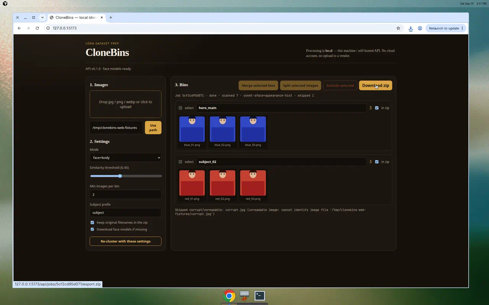
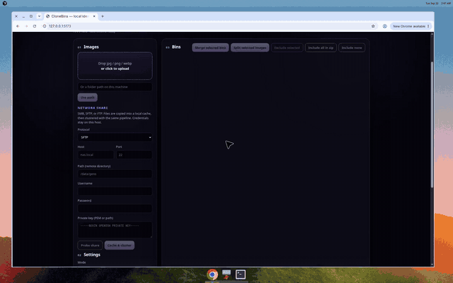

# CloneBins

Cluster AI-generated images by **face** and **body/identity**, then drop each
identity into its own folder for LoRA training datasets.

v0.1 is a local CLI, a local web UI, a Tauri 2 desktop shell, an iOS SwiftUI
client, and a shared Python core.

Processing is **offline-first / user-controlled**: CLI, web, and desktop keep
images on the machine that runs `clonebins_core`. The iOS app sends photos you
pick to a **clonebins-api you run** (Mac loopback or LAN) — not a vendor cloud.
Face model weights are downloaded once on the API/CLI host (optional if you
only need appearance clustering).

## Demo

Local web UI: cluster two identities, rename `subject_01` → `hero_main`, skip a
corrupt file, download `clonebins.zip`.





## Architecture (short)

One shared core, four clients:

| Piece | Status | Stack |
| --- | --- | --- |
| `packages/core` | **implemented** | Python: scan → embed → cluster → export |
| `packages/cli` | **implemented** | Typer + Rich |
| `packages/api` | **implemented** | FastAPI, imports `clonebins_core` |
| `apps/web` | **implemented** | Vite + React + TypeScript |
| `apps/desktop` | **implemented** | Tauri 2 + `apps/web` + Python sidecar |
| `apps/ios` | **scaffold** | SwiftUI client → user-run `clonebins-api` (Core ML stubbed) |

**Why this stack:** Python is the lingua franca of LoRA tooling and ONNX face
models. Typer keeps the MVP usable on Linux and macOS today. OpenCV YuNet +
SFace give real face embeddings without PyTorch or InsightFace in the default
path (InsightFace is an optional swap). Body/appearance uses a light local
embedding so `--mode face+body` works without a CLIP download. Desktop/web can
reuse the core via FastAPI or a sidecar. iOS is a thin SwiftUI client of the
same API (Photos/Files import, preview, zip share sheet) on the same folder
contract (`subject_01/`, `subject_02/`, …). On-device Core ML is a stub for later.

See [docs/architecture.md](docs/architecture.md) for the longer plan.

## Requirements

- Linux or macOS
- Python 3.10+
- `pip` or [`uv`](https://docs.astral.sh/uv/)
- Node 20+ (web + desktop)
- Rust 1.85+ (desktop / Tauri 2)
- macOS + Xcode 15+ (iOS client; this repo’s Linux CI cannot compile it)

## Install

From the repo root (editable, recommended):

```bash
python3 -m pip install -e packages/core -e packages/cli -e packages/api
clonebins --help
```

With uv (workspace install of both packages + dev tools):

```bash
uv sync
uv run clonebins --help
```

## Face models (one-time, optional)

Default face clustering uses two local ONNX weights from the OpenCV zoo
(Hugging Face `opencv/face_detection_yunet` and `opencv/face_recognition_sface`).
Each family has three variants; the Docker web image embeds all six:

| Detector (YuNet) | Recognizer (SFace) |
| --- | --- |
| `2023mar` FP32 (default) | `2021dec` FP32 (default) |
| `2023mar_int8` faster | `2021dec_int8` faster |
| `2023mar_int8bq` block-quant | `2021dec_int8bq` block-quant |

They are stored in `~/.cache/clonebins/models` (override with
`CLONEBINS_MODELS_DIR`). After they exist, **no network is used**.

```bash
clonebins models download          # default FP32 pair
clonebins models download --all    # all six ONNX files
clonebins models status
```

`clonebins cluster` will also try to download them on first run unless you pass
`--no-download`.

`--mode face+body` still runs if models are missing: it falls back to a local
appearance embedding (color/layout) so you can dry-run the pipeline on any
folder. Face-only mode needs the ONNX files for real identity bins.

InsightFace (`buffalo_s` / `buffalo_l`) is **not** required. The core exposes
`clonebins_core.embed.insightface_backend.InsightFaceEmbedder` if you later
`pip install 'clonebins-core[insightface]'`.

## Run

```bash
clonebins cluster --input /path/to/images --output /path/to/bins
```

Useful options:

| Flag | Default | Meaning |
| --- | --- | --- |
| `--threshold` | `0.45` | Cosine **similarity** to merge images (higher = stricter) |
| `--min-images` | `2` | Ignore clusters smaller than this (not exported) |
| `--mode` | `face` | `face` or `face+body` |
| `--dry-run` | off | Print the plan; write nothing |
| `--copy` / `--hardlink` | `--copy` | How files land in output bins |
| `--keep-names` / `--rename-index` | `--keep-names` | Original names vs `00001.jpg` |
| `--subject-prefix` | `subject` | Folders `subject_01`, `subject_02`, … |
| `--no-download` | off | Never fetch face models |
| `--recursive` / `--no-recursive` | recursive | Scan subfolders |

Behavior:

1. Recursively scans `jpg` / `jpeg` / `png` / `webp`.
2. Skips unreadable files (logged, run continues).
3. Detects the largest face per image and embeds it; `face+body` also embeds
   whole-image appearance.
4. Clusters with average-linkage agglomerative clustering.
5. Prints a summary table (bin size + sample filenames).
6. Writes `output/subject_01/`, `output/subject_02/`, … (largest first).
7. Ctrl-C cancels cleanly (exit `130`).

If several faces appear in one image, only the **largest** is used (portrait /
character assumption). Images with no usable embedding are reported as
**unmatched** and not copied.

### Smoke check (no images required)

```bash
clonebins --help
clonebins cluster --help
```

### Tiny local demo

Any folder of PNG/JPEG works. If you do not have gens handy, the test suite
builds a few synthetic portraits:

```bash
python3 -m pytest tests/test_cli.py -q
```

Or cluster a folder yourself:

```bash
clonebins cluster \
  --input ./my_gens \
  --output ./lora_bins \
  --mode face+body \
  --threshold 0.45 \
  --min-images 4 \
  --dry-run
```

Remove `--dry-run` to write bins. Prefer `--mode face` once models are
downloaded.

## Web app

Local UI on top of the same core. The browser never talks to a cloud — only to
the FastAPI process on this machine.

1. Install core + API (CLI is optional for this path):

   ```bash
   python3 -m pip install -e packages/core -e packages/api
   clonebins-api
   ```

   Listens on http://127.0.0.1:8765 (`GET /api/health`).

2. In another terminal:

   ```bash
   cd apps/web
   npm install
   npm run dev
   ```

3. Open http://127.0.0.1:5173. Vite proxies `/api` to the FastAPI port.

Or run the web UI and API together in Docker (YuNet + SFace ONNX files are
copied into the image from Hugging Face / opencv_zoo):

```bash
docker compose up --build
```

Open http://127.0.0.1:8765. Choose detector/recognizer in Settings. Bins start
**unchecked** for the zip; use **Include all in zip** or tick **in zip** per bin.
Click a thumbnail to select it; **open ↗** (or Ctrl/Cmd-click, or right-click →
Open in new tab) loads the original in a new window.

Flow: upload jpg/png/webp (corrupt files are skipped and listed) **or** type a
folder path on this machine → set threshold / min-images / `face` vs
`face+body` → preview bins with thumbnails → rename subjects, merge bins, split
or exclude images → download `clonebins.zip` (`subject_XX/…`). Clustering is
always a preview; nothing is written until you download the zip (that is the
web equivalent of CLI `--dry-run` plus a later export).

Privacy copy is in the header: processing is local / self-hosted, no cloud
account.

## Desktop app (Tauri 2)

Native macOS + Linux window around the same web UI. The shell starts
`clonebins-api` on `127.0.0.1:8765` if it is not already running (Python sidecar;
same `clonebins_core` pipeline). **Browse** picks a source folder; **Save zip…**
writes the export with a native save dialog.

```bash
python3 -m pip install -e packages/core -e packages/api
cd apps/desktop
npm install
npm run dev
```

Linux extra packages: `libwebkit2gtk-4.1-dev libgtk-3-dev librsvg2-dev patchelf`.
macOS: Xcode command-line tools.

Release binary (no installer, good for VMs):

```bash
cd apps/desktop
npm run build:unsigned
# apps/desktop/src-tauri/target/release/clonebins-desktop
```

GitHub Actions publishes Linux and macOS installers on
[Releases](https://github.com/RecognizeYourPrivilege/CloneBins/releases):

| File | Platform |
| --- | --- |
| `CloneBins-0.1.0-macos-arm64.dmg` | Apple Silicon |
| `CloneBins-0.1.0-macos-x64.dmg` | Intel Mac |
| `CloneBins-0.1.0-ubuntu-amd64.deb` | Ubuntu / Debian |
| `CloneBins-0.1.0-linux-x64.AppImage` | Generic glibc Linux |
| `CloneBins-0.1.0-archlinux-x86_64.pkg.tar.zst` | Arch |
| `CloneBins-0.1.0-alpine-x86_64.apk` | Alpine (musl; GUI if WebKit built, else CLI + API) |

macOS DMGs are not notarized — see
[apps/desktop/README.md](apps/desktop/README.md). Alpine packages from CI are
unsigned (`apk add --allow-untrusted`).

## iOS app (SwiftUI)

Thin client of the same FastAPI process. Clustering still happens in
`clonebins_core` on the Mac (or any host you run `clonebins-api` on). There is
no cloud account. True on-device Core ML embeddings are **not** in v1 (protocol
stub only).

This Linux environment cannot compile or sign iOS. On a Mac:

```bash
python3 -m pip install -e packages/core -e packages/api
clonebins-api
# simulator: 127.0.0.1:8765 is enough
# physical device: CLONEBINS_API_HOST=0.0.0.0 clonebins-api

brew install xcodegen
cd apps/ios
xcodegen generate
open CloneBins.xcodeproj
```

In-app **Settings → API base URL**: `http://127.0.0.1:8765` in Simulator, or
`http://<Mac-LAN-IP>:8765` on a phone on the same Wi-Fi.

Photos / Files import (jpg/png/webp; HEIC is converted to JPEG on device) →
threshold / min-images / `face` vs `face+body` → thumbnail bins, rename,
merge, zip share sheet. Details and honest limits:
[apps/ios/README.md](apps/ios/README.md).

## Example: prep a LoRA dataset

Goal: 10–30 images of **one** character, consistent identity, local files only.

1. Dump raw gens into `~/gens/char_x/` (png/jpg, any nested folders).
2. Install CloneBins and (recommended) download face models.
3. Cluster:

   ```bash
   clonebins cluster \
     --input ~/gens/char_x \
     --output ~/lora/char_x_bins \
     --mode face \
     --threshold 0.45 \
     --min-images 8 \
     --rename-index \
     --subject-prefix char
   ```

4. Inspect `~/lora/char_x_bins/char_01/` (largest bin — usually the main face).
   Spot-check other `char_XX` folders; they are other identities or looks that
   leaked into the dump.
5. Caption / crop as you normally would (kohya, OneTrainer, etc.). CloneBins
   only **sorts**; it does not train.
6. Point your trainer at `char_01/` (and optionally merge a second bin if it is
   the same person at a different camera distance).
7. If one person split across two bins, re-run with a **lower** `--threshold`
   (e.g. `0.35`). If two people merged, **raise** it (e.g. `0.55`).
8. `--mode face+body` helps when faces are stylized or small but outfits/hair
   colors are stable.

Hardlinks (`--hardlink`) save disk when source and destination are on the same
filesystem; CloneBins copies if linking fails.

## Privacy

- No cloud account, no vendor upload, no telemetry.
- CLI / web / desktop process files on the machine you run them on.
- iOS v1 uploads the photos you pick to **your** `clonebins-api` (loopback or
  LAN). That is still not a hosted service.
- The only optional vendor network call is fetching YuNet/SFace weights onto
  the API/CLI host.
- Do not point `--input` at folders you would not want processed on that
  machine; output bins are extra copies/hardlinks of those files.

## Development

```bash
python3 -m pip install -e packages/core -e packages/cli -e packages/api pytest httpx
python3 -m pytest
```

Layout:

```
packages/core/     shared pipeline (clonebins_core)
packages/cli/      Typer CLI (clonebins)
packages/api/      FastAPI (clonebins-api)
apps/web/          Vite + React UI
apps/desktop/      Tauri 2 shell
apps/ios/          SwiftUI + XcodeGen (LAN API client; Core ML stub)
docs/architecture.md
tests/
```

## License

MIT
